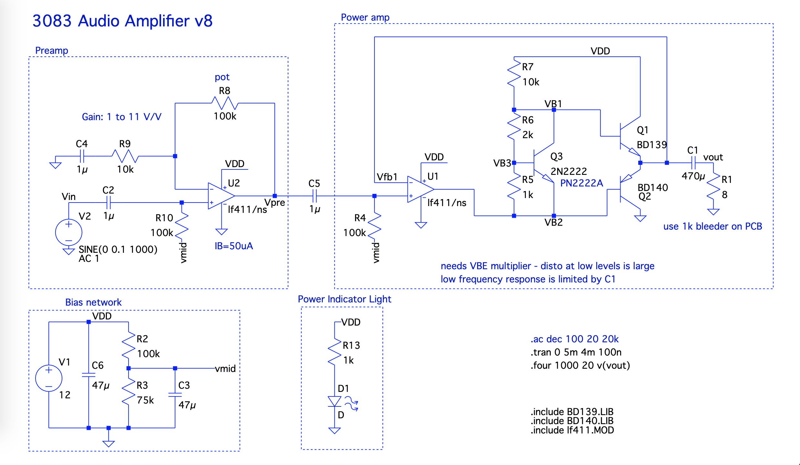
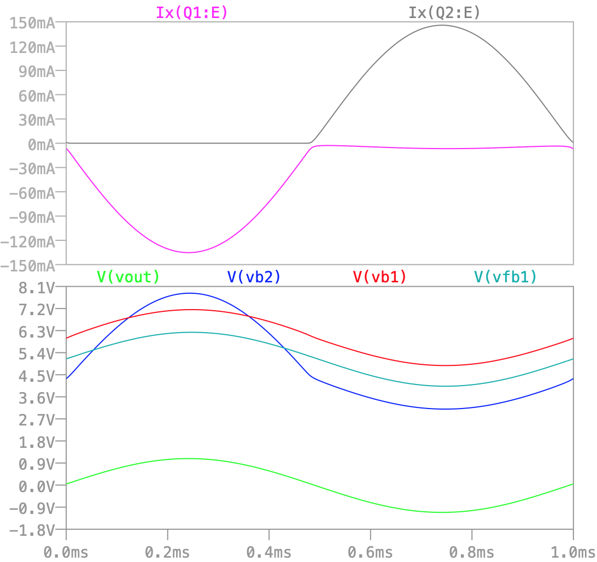
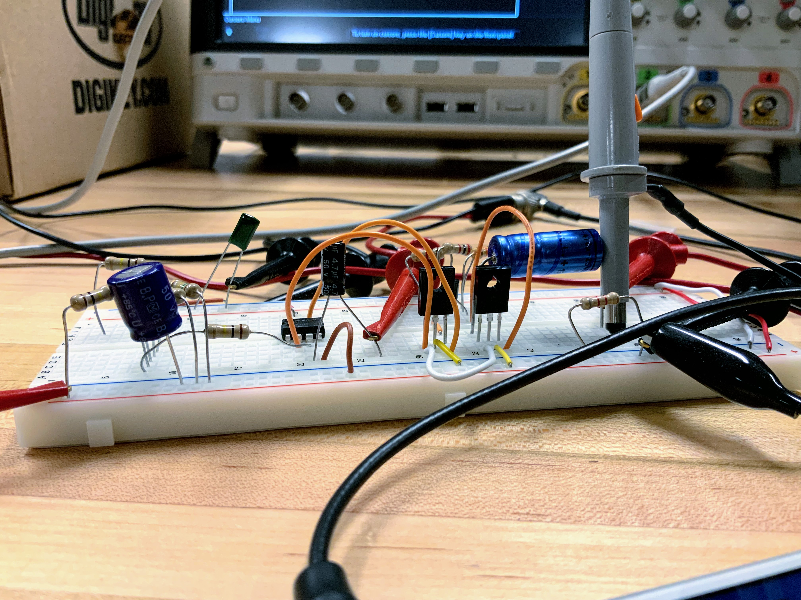
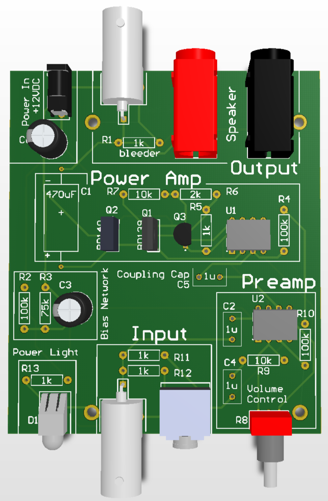

# Welcome to Audio Amp

Audio Amp is an open source, kit for teaching audio electronics in a lab setting.
It is designed to engage students at two levels of electronics experience:
1. *beginner/introductory students*, who will learn how the system works at the block diagram level, and will be able to experiment with how different audio tones sound and look on the oscilloscope.
2. *intermediate/advanced students*, who will learn how the circuit works in detail at the transistor level.

To make full use of the Audio Amp, you will need additional equipment:
* 8Ω speaker with banana plug jacks
* oscilloscope
* waveform generator

Of course, you don't need to have a top-of-the-line oscilloscope and waveform generator to make use of Audio Amp.

## Circuit Design

## Breadboard version

## PCB version

## Cost

## About Us
This project was created by William Meng with the guidance and support of Dr. David Vallancourt.
